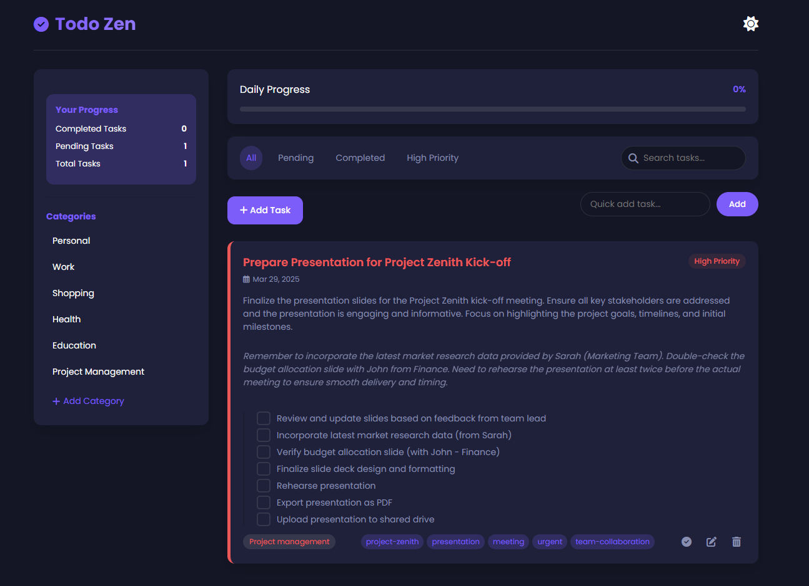

# Todo Zen - Your Minimalist Task Management App

[](https://opensource.org/licenses/MIT)
[](https://github.com/iam-kanav/todo-zen/commits/main)

[](https://iam-kanav.github.io/todo-zen/) <!-- Clickable screenshot linking to live demo -->

## Live Demo

[**Try Todo Zen Live Demo**](https://iam-kanav.github.io/todo-zen/)

## Description

Todo Zen is a simple and elegant web-based task management application designed to help you focus on what truly matters. Embracing minimalist design principles, Todo Zen offers a clean, intuitive interface to organize your tasks, track your progress, and cultivate a sense of calm and control in your daily workflow.

**Key Features:**

*   **Effortless Task Management:**
    *   Create, edit, and delete tasks with detailed attributes: titles, descriptions, notes, tags, subtasks, priority levels, categories, due dates, and optional reminders.
    *   Utilize the quick add feature for speedy task entry directly from the main interface.
    *   Mark tasks as complete and visually monitor your accomplishments.
    *   Reorganize your task list intuitively with drag-and-drop functionality.
*   **Intuitive Categorization:**
    *   Structure your tasks into customizable categories (e.g., Personal, Work, Errands).
    *   Easily manage and personalize your category list.
    *   Filter tasks by category directly from the sidebar for focused views.
*   **Powerful Filtering & Search:**
    *   Quickly filter tasks using predefined views: "All," "Pending," "Completed," and "High Priority."
    *   Leverage the robust search feature to find tasks by keywords across titles, descriptions, notes, tags, and subtask content.
*   **Progress Visualization:**
    *   Track your productivity with clear statistics on completed, pending, and total tasks.
    *   Visualize your daily task completion rate with the dynamic progress bar.
*   **Priority-Based Focus:**
    *   Assign priorities (High, Medium, Low) to tasks for better task management.
    *   Filter tasks by "High Priority" to tackle urgent items first.
*   **Timely Reminders & Notifications:**
    *   Set date and time reminders for tasks to ensure you never miss a deadline.
    *   Receive browser notifications for task reminders (browser notification permission required).
*   **Recurring Task Support:**
    *   Establish recurring tasks on a daily, weekly, or monthly basis for routine responsibilities.
*   **Efficient Context Menu:**
    *   Right-click on tasks to access a context menu with quick actions: "Complete," "Edit," "Delete," "Change Priority," and "Change Category."
*   **Sleek Dark Mode:**
    *   Switch between light and dark themes for optimal viewing comfort, day or night. Theme preference is saved for future sessions.
*   **Persistent Local Storage:**
    *   Your tasks and settings are securely stored in your browser's local storage, ensuring data persistence across browsing sessions.
*   **Drag & Drop Reordering:**
    *   Effortlessly rearrange tasks within the list to reflect changing priorities or workflow.
*   **"Don't Ask Again" Delete Confirmation:**
    *   Confirmation dialog for task deletion with a convenient "Don't ask again" option for streamlined deletion in the future.

## Technologies Used

*   **HTML5:** Semantic structure and content foundation of the application.
*   **CSS3:**  Styling and responsive layout, emphasizing a minimalist aesthetic.
*   **JavaScript (ES6+):**  Core application logic, task management features, local storage interaction, and dynamic UI updates.
*   **[Font Awesome](https://fontawesome.com/):**  Rich icon library for visual enhancements.
*   **[Poppins (Google Fonts)](https://fonts.google.com/specimen/Poppins):**  Clean and modern typography for readability.

## Setup and Installation

To experience Todo Zen locally:

1.  **Clone the GitHub Repository:**
    ```bash
    git clone https://github.com/iam-kanav/todo-zen.git
    cd todo-zen
    ```

2.  **Open `index.html` in Your Browser:**
    Navigate to the cloned `todo-zen` directory and open the `index.html` file directly in your web browser.

    **No server setup or complex installation is needed!** Todo Zen is designed to run directly in your browser.

## Usage Instructions

**Getting Started with Todo Zen:**

1.  **Adding Tasks:**
    *   **Using the "+ Add Task" Button:** Click the "**+ Add Task**" button located in the actions bar to open the "Add New Task" modal.
        *   **Task Details:** In the modal, fill in the following details:
            *   **Task Title (Required):** Enter a concise title for your task.
            *   **Description (Optional):** Provide a more detailed description if needed.
            *   **Notes (Optional):** Add any additional notes or context for the task.
            *   **Tags (Optional):** Enter comma-separated tags to categorize or label your task (e.g., `project-alpha, important`).
            *   **Subtasks (Optional):** Click "**Add Subtask**" to add multiple subtasks. Enter the description for each subtask. Use the trash icon to remove subtasks.
            *   **Priority (Required):** Select a priority level from the dropdown: "High," "Medium," or "Low."
            *   **Category (Required):** Choose a category from the dropdown. Categories can be managed via the "Manage Categories" button next to the dropdown or in the sidebar.
            *   **Due Date (Required):** Select a due date using the date picker.
            *   **Reminder (Optional):** Set a specific date and time for a reminder.
            *   **Recurrence (Optional):** Choose a recurrence pattern: "None," "Daily," "Weekly," or "Monthly."
        *   **Save Task:** Click "**Save Task**" to add the task to your list. Click "**Cancel**" to close the modal without saving.

    *   **Using Quick Add:** For quickly adding tasks with just a title:
        *   Locate the "Quick add task..." input field in the actions bar.
        *   Enter the task title directly into the input field.
        *   Click the "**Add**" button next to the input field, or press **Enter**. The task will be immediately added to your task list with default settings (you can edit it later for more details).

2.  **Managing Tasks in the Task List:**
    *   **Task Display:** Tasks are displayed in a list format in the main content area. Each task item shows the task title, due date, priority, category, and action buttons.
    *   **Marking Tasks Complete:**
        *   **Checkbox Icon:** Click the circle icon (checkmark or cross icon depending on task status) on the left side of each task item to toggle its completion status. A checkmark indicates a completed task, and a cross indicates a pending task.
        *   **Context Menu:** Right-click on a task item to open the context menu and select "**Complete**" (or "**Mark as Incomplete**" if already completed). Completed tasks will be visually marked as completed and moved to the bottom of the task list.
    *   **Editing Tasks:**
        *   **Edit Icon:** Click the "edit" icon (pencil icon) on the right side of a task item to open the "Edit Task" modal, pre-filled with the task's details. Modify the details as needed and click "**Save Task**" to update.
        *   **Context Menu:** Right-click on a task item and select "**Edit**" from the context menu to open the "Edit Task" modal.
    *   **Deleting Tasks:**
        *   **Trash Icon:** Click the "trash" icon on the right side of a task item to delete it.
        *   **Context Menu:** Right-click on a task item and select "**Delete**" from the context menu.
        *   **Confirmation Modal:** A "Confirm Delete" modal will appear to prevent accidental deletions. Click "**Delete Task**" to confirm, or "**Cancel**" to abort.
        *   **"Don't ask again" Checkbox:** In the "Confirm Delete" modal, you can check "**Don't ask again**" to bypass the confirmation modal for future deletions. This preference is saved in local storage.
    *   **Changing Task Priority and Category (Context Menu):**
        *   **Right-click** on a task item to open the context menu.
        *   **Change Priority:** Hover over "**Change Priority**" in the context menu and select a new priority level ("High," "Medium," or "Low") from the submenu.
        *   **Change Category:** Hover over "**Change Category**" and select a new category from the submenu (categories are dynamically populated from your category list).
    *   **Reordering Tasks (Drag and Drop):**
        *   **Click and Hold:** Click and hold down your mouse button on a task item.
        *   **Drag:** Drag the task item up or down within the task list to your desired position.
        *   **Drop:** Release the mouse button to drop the task in its new position. The task list will reorder accordingly.

3.  **Filtering Tasks:**
    *   **Filter Buttons:** Use the filter buttons located above the task list to quickly filter tasks based on predefined criteria:
        *   **All:** Displays all tasks, regardless of completion status or priority.
        *   **Pending:** Shows only tasks that are not yet completed.
        *   **Completed:** Displays only tasks that have been marked as completed.
        *   **High Priority:** Shows only tasks that have been assigned "High" priority.
    *   **Category Filter (Sidebar):** In the sidebar, under "Categories," click on a category name to filter the task list to show only tasks belonging to that category. Click "All" filter button to clear category filter.

4.  **Searching Tasks:**
    *   **Search Input:** Locate the "Search tasks..." input field in the filter section (top right of the task list).
    *   **Enter Keywords:** Type keywords related to the task you are looking for (task title, description, notes, tags, or subtask content).
    *   **Real-time Search:** As you type, the task list will dynamically update to display only tasks that match your search criteria. Clear the search input to show all tasks again (based on the active filter).

5.  **Category Management:**
    *   **Access Category Management:**
        *   **Sidebar:** Click the "**+ Add Category**" button located in the sidebar under "Categories."
        *   **Task Modal:** In the "Add New Task" or "Edit Task" modal, click the "**Manage Categories**" button next to the "Category" dropdown.
    *   **Category Management Modal:** The "Manage Categories" modal will open, displaying your current category list.
        *   **Adding New Categories:** Type the name of the new category in the "New category name" input field and click "**Add Category**". The new category will be added to the list and saved.
        *   **Editing Categories:** Click the "edit" icon (pencil icon) next to a category name to edit it. The category name will become editable in the list. Modify the name and click the checkmark icon to save the changes.
        *   **Deleting Categories:** Click the "trash" icon next to a category name to delete it. A confirmation prompt may appear. Deleting a category will not delete tasks within that category but will likely set their category to a default or "uncategorized" option (check app behavior).

6.  **Dark Mode:**
    *   **Toggle Theme:** Click the moon or sun icon (theme toggle) in the top right corner of the header to switch between Light Mode and Dark Mode. Your preferred theme will be saved in local storage and applied on subsequent visits.

## Contributing

We welcome contributions to enhance Todo Zen! To contribute:

1.  **Fork the Repository:** Click the "Fork" button at the top right of the [Todo Zen GitHub Repository](https://github.com/iam-kanav/todo-zen).
2.  **Create a Feature Branch:**
    ```bash
    git checkout -b feature/your-new-feature
    ```
3.  **Implement Your Changes:**  Make your code modifications and enhancements.
4.  **Commit Your Work:**
    ```bash
    git commit -m 'Add some amazing feature'
    ```
5.  **Push to Your Branch:**
    ```bash
    git push origin feature/your-new-feature
    ```
6.  **Open a Pull Request:** Navigate to the original [Todo Zen GitHub Repository](https://github.com/iam-kanav/todo-zen) and click "Compare & pull request."

## License

This project is licensed under the **MIT License**.

[](https://opensource.org/licenses/MIT)

See the [LICENSE](LICENSE) file for the full license text.

## Credits

Crafted with ❤️ by Kanav

---

Embrace a more organized and focused you with Todo Zen!

[**Explore the Code on GitHub**](https://github.com/iam-kanav/todo-zen) | [**Try the Live Demo**](https://iam-kanav.github.io/todo-zen/)
