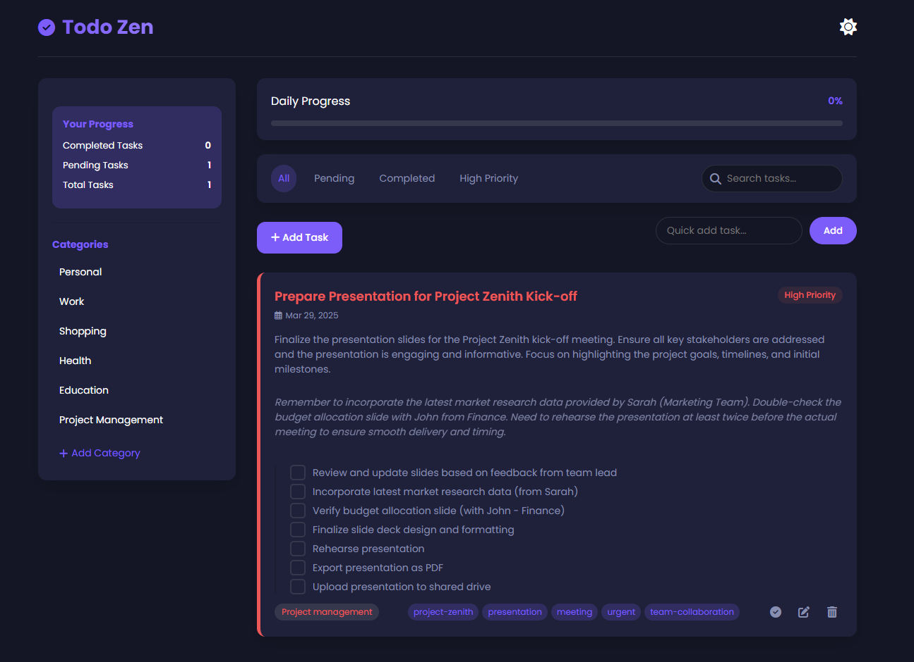

# Todo Zen - Your Minimalist Task Management App

[](https://opensource.org/licenses/MIT)
[](https://github.com/iam-kanav/todo-zen/commits/main)

[](https://iam-kanav.github.io/todo-zen/) <!-- Clickable screenshot linking to live demo -->

## Live Demo

[**Try Todo Zen Live Demo**](https://iam-kanav.github.io/todo-zen/)

## Description

Todo Zen is a simple and elegant web-based task management application designed to help you focus on what truly matters. Embracing minimalist design principles, Todo Zen offers a clean, intuitive interface to organize your tasks, track your progress, and cultivate a sense of calm and control in your daily workflow.

**Key Features:**

*   **Effortless Task Management:**
    *   Create, edit, and delete tasks with detailed attributes: titles, descriptions, notes, tags, subtasks, priority levels, categories, due dates, and optional reminders.
    *   Utilize the quick add feature for speedy task entry directly from the main interface.
    *   Mark tasks as complete and visually monitor your accomplishments.
    *   Reorganize your task list intuitively with drag-and-drop functionality.
*   **Intuitive Categorization:**
    *   Structure your tasks into customizable categories (e.g., Personal, Work, Errands).
    *   Easily manage and personalize your category list.
    *   Filter tasks by category directly from the sidebar for focused views.
*   **Powerful Filtering & Search:**
    *   Quickly filter tasks using predefined views: "All," "Pending," "Completed," and "High Priority."
    *   Leverage the robust search feature to find tasks by keywords across titles, descriptions, notes, tags, and subtask content.
*   **Progress Visualization:**
    *   Track your productivity with clear statistics on completed, pending, and total tasks.
    *   Visualize your daily task completion rate with the dynamic progress bar.
*   **Priority-Based Focus:**
    *   Assign priorities (High, Medium, Low) to tasks for better task management.
    *   Filter tasks by "High Priority" to tackle urgent items first.
*   **Timely Reminders & Notifications:**
    *   Set date and time reminders for tasks to ensure you never miss a deadline.
    *   Receive browser notifications for task reminders (browser notification permission required).
*   **Recurring Task Support:**
    *   Establish recurring tasks on a daily, weekly, or monthly basis for routine responsibilities.
*   **Efficient Context Menu:**
    *   Right-click on tasks to access a context menu with quick actions: "Complete," "Edit," "Delete," "Change Priority," and "Change Category."
*   **Sleek Dark Mode:**
    *   Switch between light and dark themes for optimal viewing comfort, day or night. Theme preference is saved for future sessions.
*   **Persistent Local Storage:**
    *   Your tasks and settings are securely stored in your browser's local storage, ensuring data persistence across browsing sessions.
*   **Drag & Drop Reordering:**
    *   Effortlessly rearrange tasks within the list to reflect changing priorities or workflow.
*   **"Don't Ask Again" Delete Confirmation:**
    *   Confirmation dialog for task deletion with a convenient "Don't ask again" option for streamlined deletion in the future.

## Technologies Used

*   **HTML5:** Semantic structure and content foundation of the application.
*   **CSS3:**  Styling and responsive layout, emphasizing a minimalist aesthetic.
*   **JavaScript (ES6+):**  Core application logic, task management features, local storage interaction, and dynamic UI updates.
*   **[Font Awesome](https://fontawesome.com/):**  Rich icon library for visual enhancements.
*   **[Poppins (Google Fonts)](https://fonts.google.com/specimen/Poppins):**  Clean and modern typography for readability.

## Setup and Installation

To experience Todo Zen locally:

1.  **Clone the GitHub Repository:**
    ```bash
    git clone https://github.com/iam-kanav/todo-zen.git
    cd todo-zen
    ```

2.  **Open `index.html` in Your Browser:**
    Navigate to the cloned `todo-zen` directory and open the `index.html` file directly in your web browser.

    **No server setup or complex installation is needed!** Todo Zen is designed to run directly in your browser.

## Usage Instructions

[Refer to the "Usage Instructions" section from the previous `README.md` for detailed guidance on adding, managing, filtering, searching tasks, category management, and dark mode toggling.]

## Contributing

We welcome contributions to enhance Todo Zen! To contribute:

1.  **Fork the Repository:** Click the "Fork" button at the top right of the [Todo Zen GitHub Repository](https://github.com/iam-kanav/todo-zen).
2.  **Create a Feature Branch:**
    ```bash
    git checkout -b feature/your-new-feature
    ```
3.  **Implement Your Changes:**  Make your code modifications and enhancements.
4.  **Commit Your Work:**
    ```bash
    git commit -m 'Add some amazing feature'
    ```
5.  **Push to Your Branch:**
    ```bash
    git push origin feature/your-new-feature
    ```
6.  **Open a Pull Request:** Navigate to the original [Todo Zen GitHub Repository](https://github.com/iam-kanav/todo-zen) and click "Compare & pull request."

## License

This project is licensed under the **MIT License**.

[](https://opensource.org/licenses/MIT)

See the [LICENSE](LICENSE) file for the full license text.

## Credits

Crafted with ❤️ by Kanav

---

Embrace a more organized and focused you with Todo Zen!

[**Explore the Code on GitHub**](https://github.com/iam-kanav/todo-zen) | [**Try the Live Demo**](https://iam-kanav.github.io/todo-zen/)
